# JM BeautyFlow — Fluxograma do sistema completo (estado atual)

**Uso no Canva:** copie cada bloco `mermaid` em https://mermaid.live → Export PNG/SVG → importe no Canva.

**Data de referência:** maio/2026 · produção `jmbeautyflow.tech` · Supabase `rfdphonjgsmyeqnsfjom`

---

## Legenda

| Ator | Descrição |
|------|-----------|
| Visitante | Não logado — home, planos, cadastro |
| Admin (tenant) | Dono do studio — painel `/admin` |
| Cliente final | Agenda em `/agendar/:slug` |
| Master | Plataforma — `/master/*` |
| Mercado Pago | Checkout e webhooks de assinatura |
| Supabase | Auth, Postgres, Edge Functions |
| VPS | Hospeda o front SSR (PM2 + Nginx) |

---

## 1. Ecossistema macro

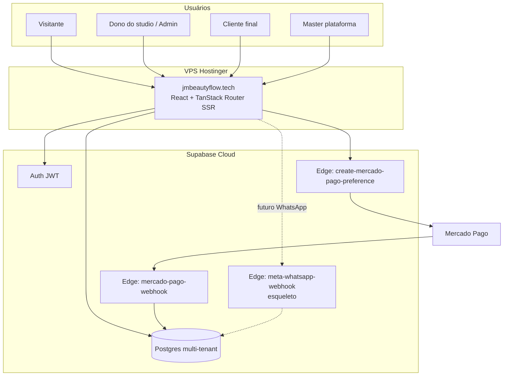

---

## 2. Jornada completa (marketing → operação)

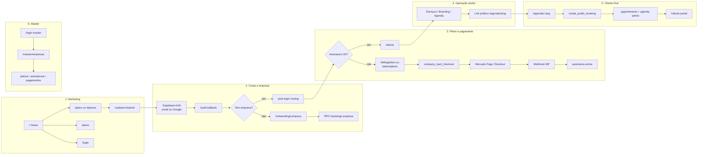

---

## 3. Autenticação e roteamento pós-login

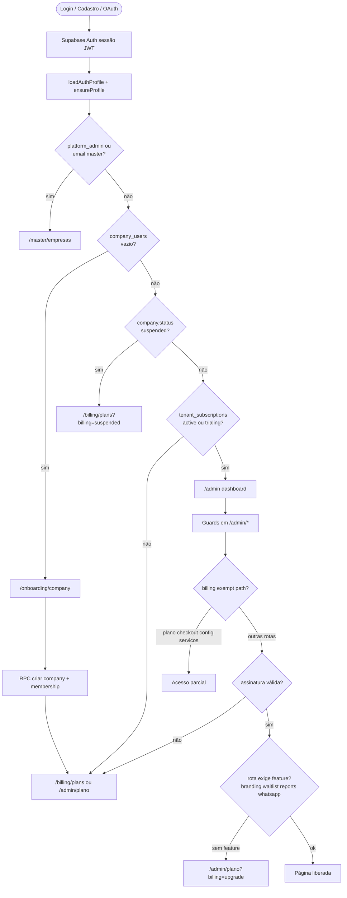

---

## 4. Cadastro self-serve (novo tenant)

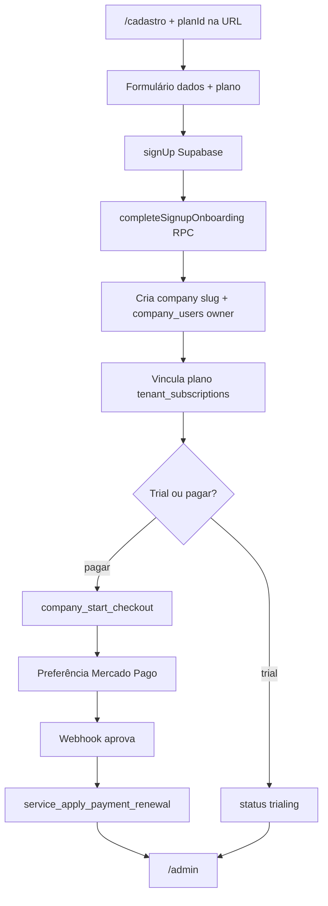

---

## 5. Cobrança Mercado Pago

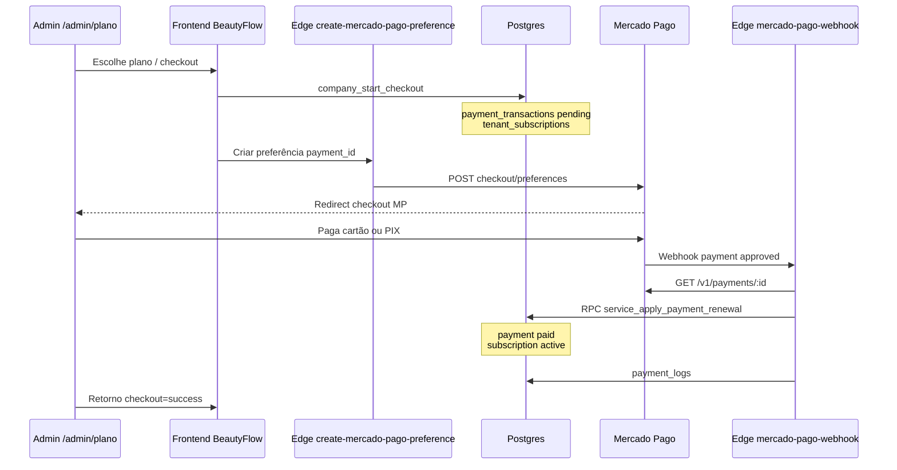

---

## 6. Agendamento público → agenda admin

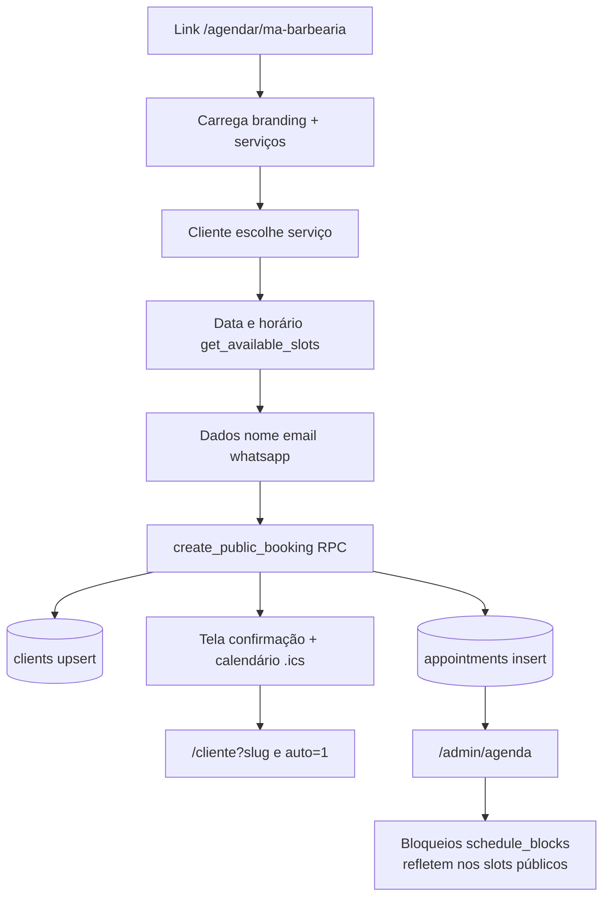

---

## 7. Portal do cliente

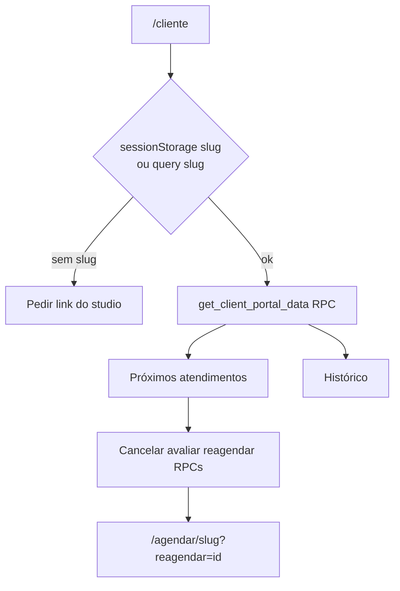

---

## 8. Painel Admin (módulos)

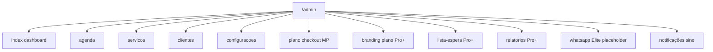

---

## 9. Painel Master

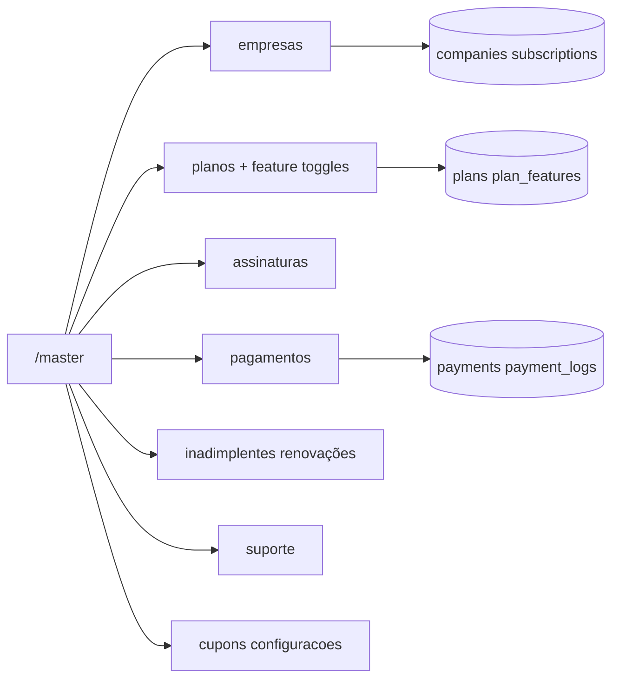

---

## 10. WhatsApp hoje (apenas manual)

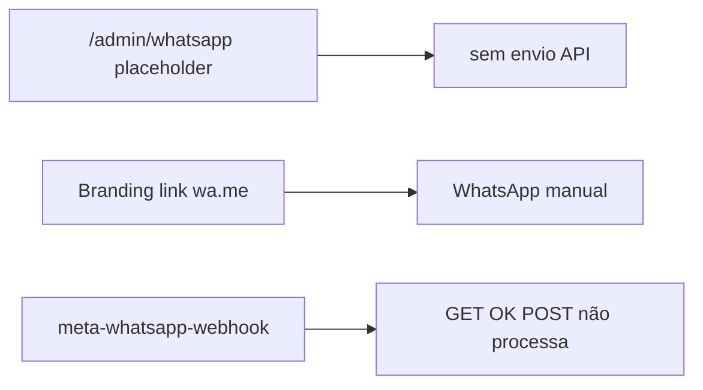

---

## 11. Deploy produção

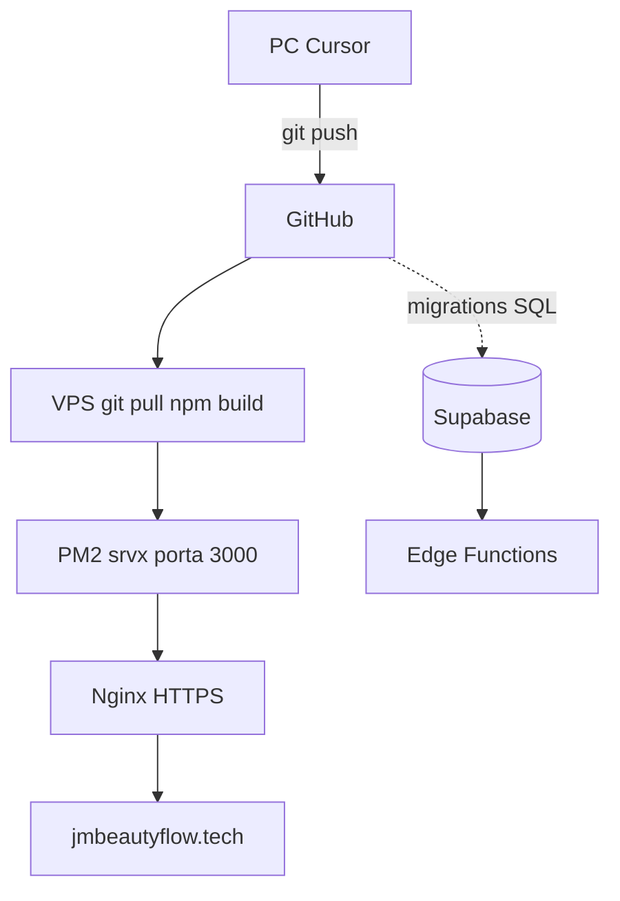

---

## Fluxo linear simplificado (uma linha para Canva)

```
Visitante → Home/Plans → Cadastro ou Login → Auth Supabase
  → Sem empresa? Onboarding → Sem assinatura? Mercado Pago → /admin
  → Link /agendar/:slug → Cliente agenda → Agenda admin + /cliente
  (Paralelo: Master gerencia empresas e planos)
```

---

## Rotas principais

| Área | Rotas |
|------|--------|
| Público | `/`, `/plans`, `/cadastro`, `/login`, `/demo` |
| Auth | `/auth/callback`, `/forgot-password`, `/reset-password` |
| Onboarding | `/onboarding/company` |
| Billing | `/billing/plans`, `/billing/checkout`, `/admin/plano`, `/admin/plano/checkout` |
| Admin | `/admin`, `/admin/agenda`, `/admin/servicos`, `/admin/clientes`, `/admin/branding`, … |
| Cliente | `/agendar/:slug`, `/cliente` |
| Master | `/master/empresas`, `/master/planos`, `/master/pagamentos`, … |

---

## O que não entra no fluxo ativo hoje

- Envio automático WhatsApp Cloud API (só placeholder + `wa.me` no branding)
- Pagamento simulado em produção (só `DEV`)
- Fallback fake de planos (só Supabase `list_public_plans`)

---

*Arquivo local — pasta `docs/export-canva/` — uso Canva / documentação.*
