# JM BeautyFlow — Fluxograma integração WhatsApp Meta (Cloud API)

**Uso no Canva:** copie cada bloco `mermaid` em https://mermaid.live → Export PNG/SVG → importe no Canva.

**Branch de trabalho:** `feature/whatsapp-meta-integration`  
**Checkpoint rollback:** tag Git `pre-whatsapp-2026-05-22`  
**Estado atual do código:** schema + webhook esqueleto; envio automático **não** implementado

---

## Legenda

| Item | Significado |
|------|-------------|
| Verde no produto | Já existe no banco ou no código base |
| Tracejado | A implementar na Fase WhatsApp |
| Elite | Plano com feature `whatsapp` via `plan_features` |

---

## 1. Arquitetura alvo (visão geral)

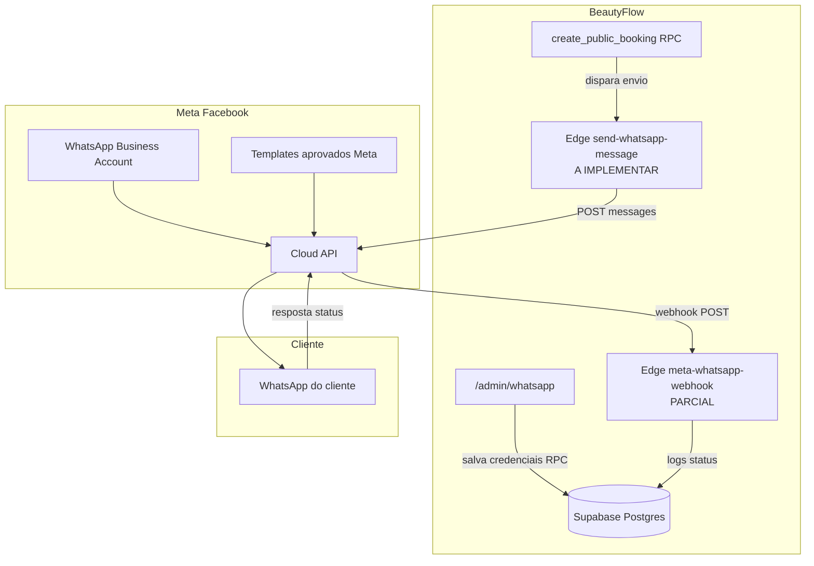

---

## 2. Fases da integração (roadmap)

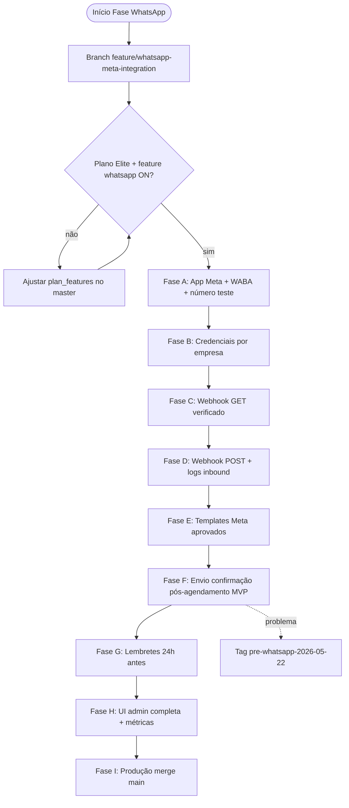

---

## 3. Estado ATUAL vs FUTURO

```mermaid
flowchart LR
  subgraph Hoje["HOJE no sistema"]
    H1[whatsapp_connections tabela]
    H2[meta-whatsapp-webhook GET OK]
    H3[POST retorna processed false]
    H4[/admin/whatsapp placeholder]
    H5[wa.me no branding manual]
  end

  subgraph Futuro["META integração"]
    F1[Salvar token cifrado por empresa]
    F2[Enviar template confirmação]
    F3[Lembrete automático]
    F4[Logs whatsapp_message_logs]
    F5[Opt-in na página agendar]
  end

  Hoje -.->|Fase B a I| Futuro
```

---

## 4. Onboarding WhatsApp por tenant

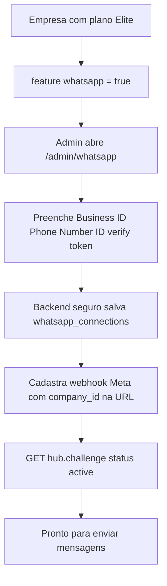

**URL webhook (por empresa):**

`https://rfdphonjgsmyeqnsfjom.supabase.co/functions/v1/meta-whatsapp-webhook?company_id=UUID_DA_EMPRESA`

---

## 5. Credenciais (Fase B) — sequência

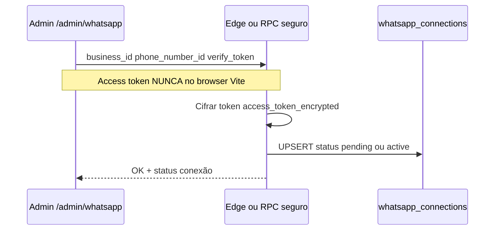

**Campos no banco:** `business_id`, `phone_number_id`, `display_phone_number`, `webhook_verify_token`, `access_token_encrypted`, `status`

---

## 6. Webhook verificação GET (Fase C) — já existe

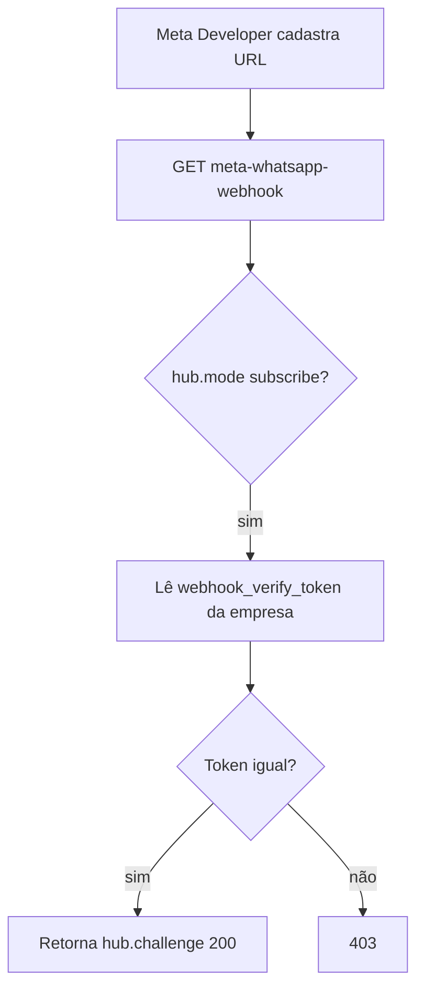

---

## 7. Webhook POST inbound (Fase D) — a completar

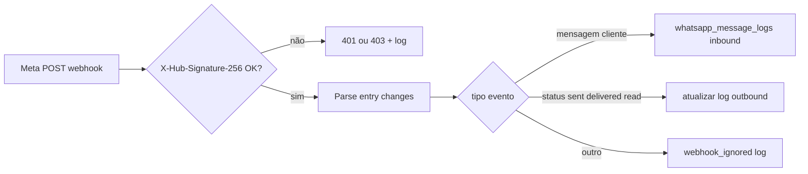

**Secrets:** `META_APP_SECRET`, `SUPABASE_SERVICE_ROLE_KEY`

---

## 8. Templates Meta (Fase E)

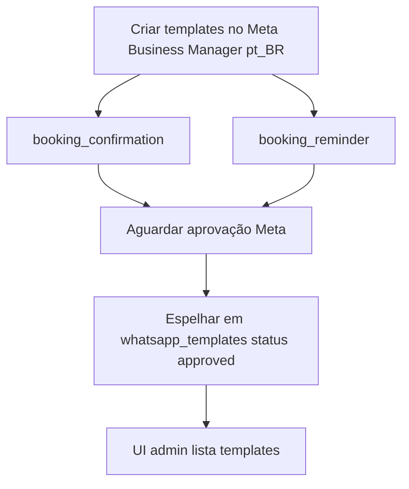

---

## 9. Confirmação pós-agendamento MVP (Fase F)

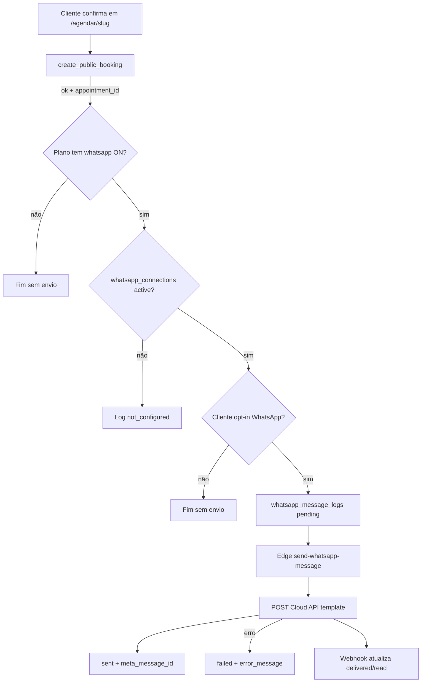

---

## 10. Lembrete 24h (Fase G)

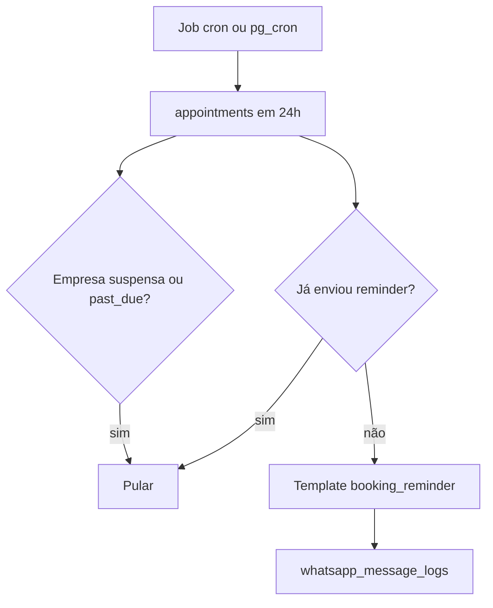

---

## 11. Git — como salvar durante a integração

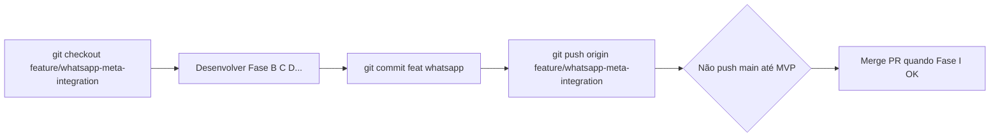

---

## 12. Rollback se der problema

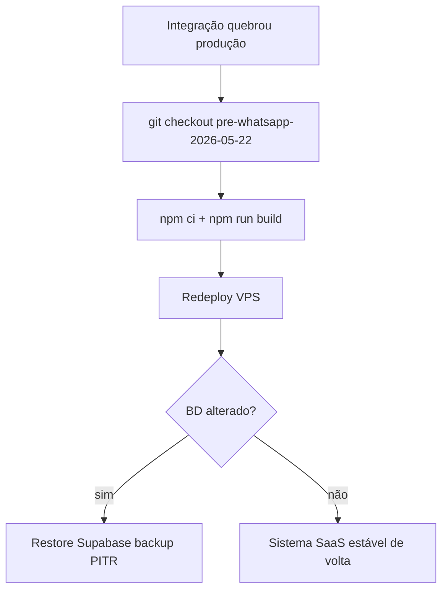

---

## Checklist resumido

### Fase 0 — Git
- [ ] Branch `feature/whatsapp-meta-integration`
- [ ] Push só nessa branch

### Fase A — Meta
- [ ] App Developers + produto WhatsApp
- [ ] WABA + Phone Number ID
- [ ] `META_APP_SECRET` no Supabase

### Fase B — Credenciais
- [ ] RPC/Edge salvar `whatsapp_connections`
- [ ] UI `/admin/whatsapp` formulário

### Fase C — Webhook GET
- [ ] URL com `company_id` verificada no Meta

### Fase D — Webhook POST
- [ ] Gravar `whatsapp_message_logs`
- [ ] Assinatura HMAC em produção

### Fase E — Templates
- [ ] `booking_confirmation` aprovado

### Fase F — MVP
- [ ] Opt-in no agendar
- [ ] Envio após `create_public_booking`
- [ ] Teste celular real

### Fase G–I
- [ ] Lembretes
- [ ] Dashboard métricas
- [ ] Merge `main` + deploy

---

## Sprints sugeridos

| Sprint | Entrega |
|--------|---------|
| S1 | Fase B + C — conectar + webhook verificado |
| S2 | Fase D + E — inbound + templates |
| S3 | Fase F — confirmação agendamento |
| S4 | Fase G + H — lembretes + UI |
| S5 | Fase I — produção |

---

*Arquivo local — pasta `docs/export-canva/` — uso Canva / documentação.*
